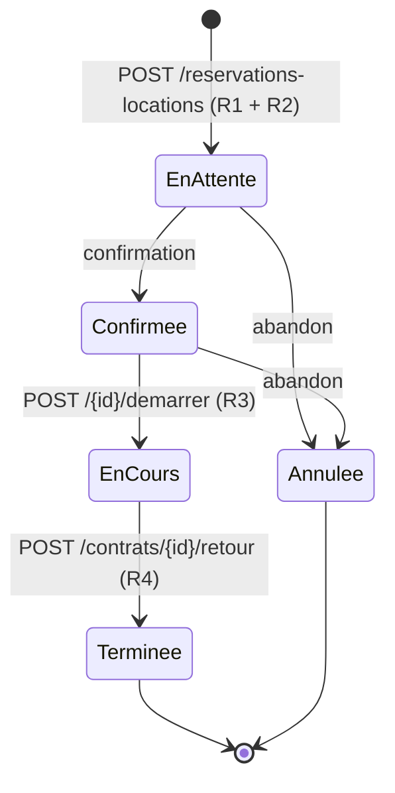
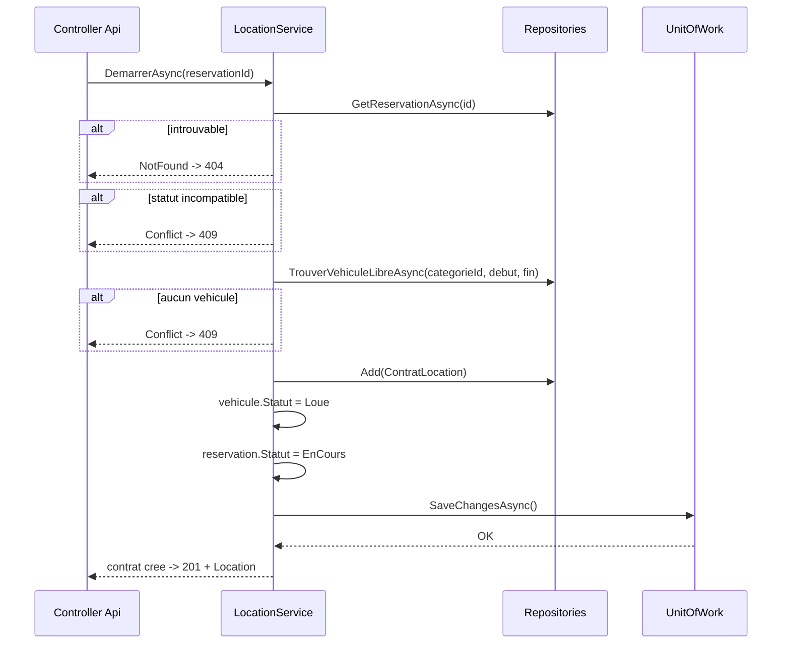
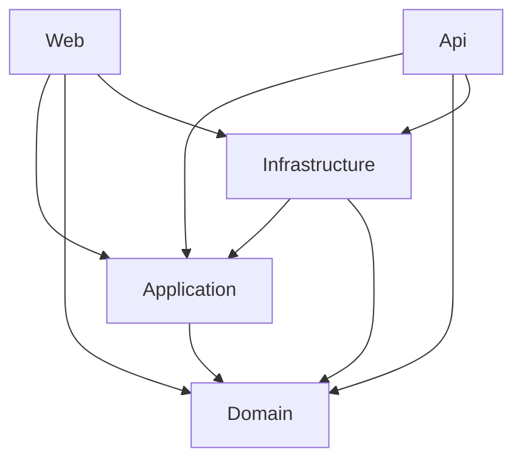

# LocaCar — Diagramme du modèle

> Document de conception — Jalon 1.

## 1. Diagramme entité-association

```mermaid
erDiagram
    AGENCE ||--o{ VEHICULE : "rattache"
    CATEGORIE_VEHICULE ||--o{ VEHICULE : "classe"
    CATEGORIE_VEHICULE ||--o{ RESERVATION_LOCATION : "tarifie"
    CLIENT ||--o{ RESERVATION_LOCATION : "demande"
    RESERVATION_LOCATION ||--o| CONTRAT_LOCATION : "donne lieu a"
    VEHICULE ||--o{ CONTRAT_LOCATION : "est affecte a"

    AGENCE {
        int Id PK
        string Code UK
        string Nom
        string Ville
        string Adresse
    }

    CLIENT {
        int Id PK
        string Numero UK
        string Nom
        string Telephone
        string NumeroPermis
        DateOnly ExpirationPermis
    }

    CATEGORIE_VEHICULE {
        int Id PK
        string Code UK
        string Libelle
        decimal TarifJournalier
        decimal Caution
        decimal PenaliteRetardParJour
    }

    VEHICULE {
        int Id PK
        string Immatriculation UK
        string Modele
        StatutVehicule Statut
        int CategorieVehiculeId FK
        int AgenceId FK
    }

    RESERVATION_LOCATION {
        int Id PK
        int ClientId FK
        int CategorieVehiculeId FK
        DateTime Debut
        DateTime Fin
        StatutReservationLocation Statut
        decimal MontantEstime
    }

    CONTRAT_LOCATION {
        int Id PK
        int ReservationLocationId FK-UK
        int VehiculeId FK
        DateTime Depart
        DateTime RetourPrevu
        DateTime RetourReel "nullable"
        decimal MontantFinal "nullable"
    }
```

Toutes les entités héritent de `BaseEntity`
(`Id`, `CreatedAt`, `UpdatedAt`, `IsDeleted`, `DeletedAt`, `RowVersion`).
Ces colonnes techniques ne sont pas répétées dans le diagramme.

## 2. Workflow principal — LocationService.GererAsync



### Effets couplés à chaque transition

| Transition | Réservation | Véhicule | Contrat |
|---|---|---|---|
| Création (R1 + R2) | `EnAttente` / `Confirmee`, `MontantEstime` calculé | inchangé | — |
| Démarrage (R3) | `EnCours` | `Disponible` -> `Loue` | créé (`Depart`, `RetourPrevu`) |
| Retour (R4) | `Terminee` | `Loue` -> `Disponible` | `RetourReel`, `MontantFinal` |

Chaque ligne de ce tableau correspond à **un seul appel à `SaveChangesAsync()`** :
les colonnes d'une même ligne sont écrites de façon atomique.

## 3. Séquence du démarrage (R3)



## 4. Sens des références entre projets



`Domain` ne référence rien. `Application` ne référence que `Domain`.
Aucune référence inverse n'est autorisée : un `using` ne remplace pas une `ProjectReference`.
